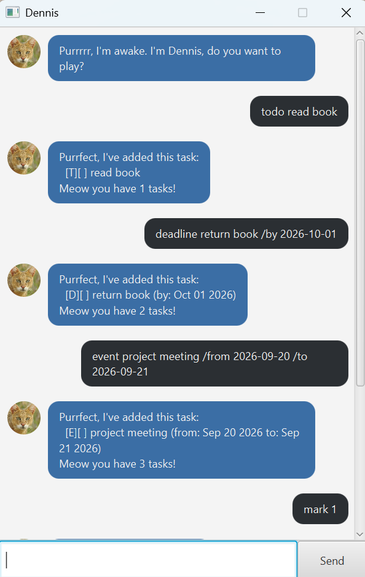

# Dennis User Guide



Dennis is a desktop chatbot for tracking your tasks: todos, deadlines, events, and anything that just needs doing sometime within a period.

## Quick start

1. Ensure you have Java `25` or above installed on your computer.
2. Download the latest `dennis.jar` from the [releases page](https://github.com/Gnanes99/ip/releases).
3. Copy the file to the folder you want to use as Dennis's home folder.
4. Open a command terminal, `cd` into that folder, and run `java -jar dennis.jar`. A window like the one above should appear in a few seconds.
5. Type a command in the text box at the bottom and press Enter (or click **Send**). Try a few:
   - `list`: shows all your tasks
   - `todo read book`: adds a todo
   - `bye`: says goodbye and closes Dennis
6. See [Features](#features) below for what every command does.

## Notes on the command format

- Words in `UPPER_CASE` are parameters you supply, e.g. in `todo DESCRIPTION`, `DESCRIPTION` could be `todo read book`.
- Every date is typed as `yyyy-MM-dd`, e.g. `2026-12-01`.
- `INDEX` refers to the task number shown by the most recent `list` or `on`. `find`'s numbers are for display only; see the [Finding tasks](#finding-tasks-find) note below.
- A description or date cannot contain the `|` character.
- Dennis won't add a task that's an exact duplicate (same type, description, and dates) of one already on your list.

## Command summary

| Action | Format | Example |
|--------|--------|---------|
| Todo | `todo DESCRIPTION` | `todo read book` |
| Deadline | `deadline DESCRIPTION /by DATE` | `deadline return book /by 2026-12-01` |
| Event | `event DESCRIPTION /from DATE /to DATE` | `event project meeting /from 2026-12-02 /to 2026-12-05` |
| Within | `within DESCRIPTION /from DATE /to DATE` | `within collect certificate /from 2026-01-15 /to 2026-01-25` |
| List | `list` | `list` |
| Mark | `mark INDEX` | `mark 2` |
| Unmark | `unmark INDEX` | `unmark 2` |
| Delete | `delete INDEX` | `delete 2` |
| Find | `find KEYWORD` | `find book` |
| On | `on DATE` | `on 2026-12-01` |
| Bye | `bye` | `bye` |

## Features

### Adding a todo: `todo`

Adds a task with just a description, no date attached.

Example: `todo read book`

Expected output:
```
Purrfect, I've added this task:
  [T][ ] read book
Meow you have 1 tasks!
```

### Adding a deadline: `deadline`

Adds a task that must be done by a specific date.

Example: `deadline return book /by 2026-12-01`

Expected output:
```
Purrfect, I've added this task:
  [D][ ] return book (by: Dec 01 2026)
Meow you have 1 tasks!
```

### Adding an event: `event`

Adds a task that spans a start and end date.

Example: `event project meeting /from 2026-12-02 /to 2026-12-05`

Expected output:
```
Purrfect, I've added this task:
  [E][ ] project meeting (from: Dec 02 2026 to: Dec 05 2026)
Meow you have 1 tasks!
```

### Adding a task within a period: `within`

Adds a task that just needs to be done sometime between two dates.

Example: `within collect certificate /from 2026-01-15 /to 2026-01-25`

Expected output:
```
Purrfect, I've added this task:
  [W][ ] collect certificate (within: Jan 15 2026 to: Jan 25 2026)
Meow you have 1 tasks!
```

### Listing all tasks: `list`

Shows every task, numbered from 1.

Example: `list`

Expected output:
```
Here's your list. Try to keep it that way.
1.[T][ ] read book
2.[D][ ] return book (by: Dec 01 2026)
```

### Marking a task as done: `mark`

Marks the specified task as done.

Example: `mark 2`

Expected output:
```
Paw-sitively marked as done:
  [D][X] return book (by: Dec 01 2026)
```

### Marking a task as not done: `unmark`

Marks the specified task as not done.

Example: `unmark 2`

Expected output:
```
Un-fur-tunately, back on the list:
  [D][ ] return book (by: Dec 01 2026)
```

### Deleting a task: `delete`

Removes the specified task from the list.

Example: `delete 2`

Expected output:
```
Scratched this task off the list:
  [D][ ] return book (by: Dec 01 2026)
Meow there are 1 tasks left!
```

### Finding tasks: `find`

Finds every task whose description contains the given keyword.

Example: `find book`

Expected output:
```
Purr-fect, found these matching tasks:
1.[T][ ] read book
```

> 💡 The search is case-sensitive and matches anywhere in the description, so `find boo` also matches "read **boo**k". The numbers shown here start from 1 in match order, not your task's real position in the list, so don't use them with `mark`, `unmark`, or `delete`. Use `list` first if you need to act on a match.

### Viewing tasks on a date: `on`

Shows every deadline or event that falls on the given date. An event counts on every day from its start to its end, inclusive.

Example: `on 2026-12-01`

Expected output:
```
Here's what's happening on Dec 01 2026, if you must know.
2.[D][ ] return book (by: Dec 01 2026)
```

### Exiting the program: `bye`

Says goodbye and closes Dennis.

Example: `bye`

Expected output:
```
Time for a cat-nap. Bye!
```

## Saving the data

Dennis saves your tasks to disk automatically after every command that changes the list. There's no need to save manually.
